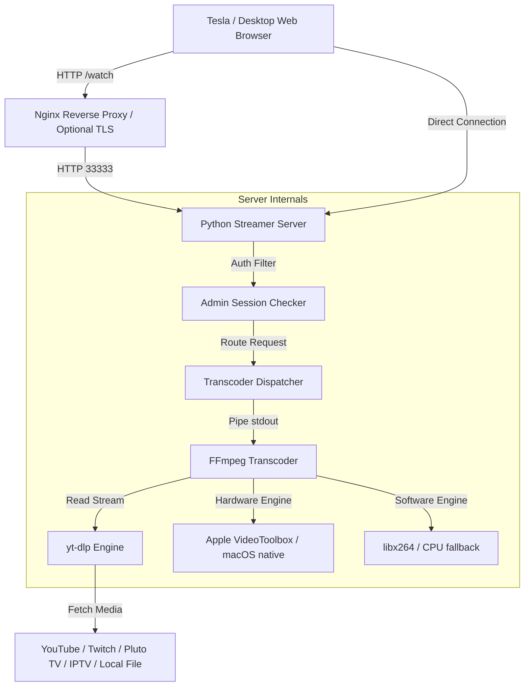

# 🚗 OpenCarStream

[](https://opensource.org/licenses/MIT)
[]()
[]()
[]()

Stream high-quality videos directly to your Tesla's integrated web browser. OpenCarStream seamlessly handles transcode profiling, serving optimized formats like **OGV (Ogg Theora/Vorbis)** for Tesla-friendly rendering, **native MP4** for high-efficiency browsers, and **MJPEG** as an ultra-compatible fallback.

---

## 🚀 Key Upgrades in this Version

This fork modernizes and secures OpenCarStream with several major enhancements:

### 🍏 Native macOS Apple Silicon (ARM64) Support
* **Hardware Acceleration**: Out-of-the-box integration with Apple’s **VideoToolbox** framework (`h264_videotoolbox` encoder and `videotoolbox` hardware decoding acceleration).
* **Massive CPU Savings**: Offloading transcoding to Apple Silicon media engines keeps CPU usage typically **under 15%** (run silent, cool, and power-efficient).
* **macOS Services**: Native runner scripts (`setup_native.sh`, `run_native.sh`) and a comprehensive daemon script (`manage_service.sh`) to install and monitor OpenCarStream as an automatic background `launchd` service.

### 🔒 Webapp Admin Security Layer
* **Password Lock**: Access to the status page, channels, feeds, and streaming endpoints can be secured by specifying an `ADMIN_PASSWORD` (default: `"admin"`).
* **Robust Session Management**: Provides a modern, responsive login interface, secure session cookies, tokenized URL parameters (`?auth=...` or `?token=...`), and Basic/Bearer header authentication.

### 📺 High-Resolution Streaming (1080p, 2K, 4K)
* **Uncapped Resolutions**: Resolved legacy 360p caps, enabling full high-definition support (up to **1080p, 1440p, and 4K** source streams).
* **Precise Transcode Controls**: Overridable resolution constraints and bitrates (e.g. `MP4_WIDTH`, `OGV_WIDTH`, and custom target bitrates) to fine-tune quality vs. network constraints.

### 🧠 Smart Agent & Format Detection
* **Dynamic Content Negotiation**: Automatically detects Tesla web browsers and defaults to `OGV` format (powered by OGV.js) for stable playback, while falling back to high-performance `MP4` for standard browsers (like Safari and Chrome on macOS/Windows).
* **MSE Player**: MP4 streaming utilizes a modern MediaSource Extensions (MSE) player to improve streaming latency, buffering efficiency, and compatibility.
* **Safety Disclaimers**: Integrated interactive safety check-ins to encourage responsible, stationary media usage.

### 🎨 Subscription & IPTV Logo Scraping
* **YouTube Logos**: `sync_subscriptions.py` now downloads YouTube channel thumbnail metadata automatically.
* **Batch Scraper**: Added `populate_logos.py` to scrape public channel pages for missing/existing subscription logos and cache them in `subscriptions.json`.
* **IPTV Branding**: The IPTV player extracts `tvg-logo` or `logo` attributes from `.m3u` / `.m3u8` playlists and presents logo previews inline next to stream titles.

---

## 📐 Architecture Overview



---

## ⚡ Quick Start

Choose between running natively on macOS (recommended for Apple Silicon users) or containerized with Docker.

### Option A: Native macOS Setup (Apple Silicon)

Ensure you have [Homebrew](https://brew.sh) installed. Then run:

```bash
# 1. Run the native setup (installs Homebrew dependencies & sets up venv)
./setup_native.sh

# 2. Run the server interactively
./run_native.sh
```

To run it as a persistent system background service, use the daemon manager:

```bash
# Install the launchd agent (starts automatically on login)
./manage_service.sh install

# Monitor service status and resource usage
./manage_service.sh status

# Follow logs in real-time
./manage_service.sh logs
```
For more details, see the dedicated [macOS Native Guide (README_native.md)](file:///Users/trinityhades/opencarstream/README_native.md).

---

### Option B: Docker Deployment

Ideal for Linux, NAS servers, or cross-platform machines.

```bash
# Start the streamer container
docker compose up -d --build
```

If Docker Hub is rate-limited in your region, override the Python base image:
```bash
PYTHON_IMAGE=mirror.gcr.io/library/python:3.12-slim docker compose up -d --build
```

Access the dashboard at **`http://YOUR_SERVER_IP:33333/`**.

---

## ⚙️ Environment Variables

Customize streamer behaviors by setting variables in your shell environment, `.env` file, or the `environment` section of `docker-compose.yml`:

| Variable | Default | Description |
| :--- | :--- | :--- |
| `ADMIN_PASSWORD` | `admin` | Password for webapp and stream protection. Set empty to disable. |
| `PORT` | `33333` | Public port the streamer listens on. |
| `FFMPEG_HWACCEL` | `auto` | Set hardware acceleration framework (`videotoolbox`, `vaapi`, `nvdec`, etc.). |
| `FFMPEG_H264_ENCODER`| `auto` | Encoder to use (`h264_videotoolbox` on macOS, or fallback `libx264`). |
| `MP4_WIDTH` | `1920` | Native MP4 transcode width (px). |
| `MP4_HEIGHT` | `1080` | Native MP4 transcode height (px). |
| `MP4_VIDEO_BITRATE` | `1800k` | Video bitrate target for MP4 streams. |
| `MP4_AUDIO_BITRATE` | `128k` | Audio bitrate target for MP4 streams. |
| `OGV_WIDTH` | `1920` | OGV.js transcode width (px) for Tesla. |
| `OGV_HEIGHT` | `1080` | OGV.js transcode height (px) for Tesla. |
| `OGV_FPS` | `24` | OGV.js frame rate target. |
| `OGV_VIDEO_QUALITY` | `5` | Theora video quality setting (1-10 scale). |
| `OGV_AUDIO_BITRATE` | `96k` | Vorbis audio bitrate target. |
| `MJPEG_FPS` | `12` | Frame rate for MJPEG compat-mode fallback. |
| `FFMPEG_QUALITY` | `26` | Quality compression value for MJPEG fallback (1-31 scale). |
| `LOCAL_MEDIA_DIR` | `./local-media` | Host directory containing video files for offline playback. |
| `IPTV_LISTS_DIR` | `./iptv_lists` | Host directory containing `.m3u` / `.m3u8` playlist files. |
| `SUBSCRIPTIONS_FILE` | `./config/subscriptions.json` | Path to YouTube channel subscriptions config. |

---

## 📺 Channel Feeds & Subscriptions

Browse recent video uploads from your favorite YouTube channels natively inside your vehicle.

### 1. Sync Subscriptions
Connect to your active browser profile and export subscribed channels to `subscriptions.json`:

```bash
# Sync from Chrome (supported: chrome, firefox, edge, chromium, safari, brave)
uv run sync_subscriptions.py --browser chrome --output config/subscriptions.json
```
If your setup doesn't support direct extraction, export a Netscape `cookies.txt` file and run:
```bash
uv run sync_subscriptions.py --cookies /path/to/cookies.txt --output config/subscriptions.json
```

### 2. Populate Channel Logos
Ensure your subscription cards have clean logos in the UI by running the scraper:

```bash
# Pulls missing logo graphics by scraping public YouTube headers
python3 populate_logos.py --file config/subscriptions.json
```

---

## 🔌 IPTV Playlists

Mount or copy your `.m3u`/`.m3u8` files into the `IPTV_LISTS_DIR` directory (Docker volumes, or the native `./iptv_lists` folder):

```text
./iptv_lists/sports.m3u
./iptv_lists/news.m3u8
```

The IPTV engine automatically parses stream entries and pulls logos matching `tvg-logo="..."` or `logo="..."` attributes. Open the **IPTV** tab in the UI to choose a list and browse channels.

---

## 📡 API Endpoints

| Endpoint | Method | Description |
| :--- | :--- | :--- |
| `/` | `GET` | Main status dashboard (requires auth if configured). |
| `/login` | `GET/POST` | Authenticate sessions and authorize streaming cookies. |
| `/watch?url=...` | `GET` | Playback watch page (handles OGV/MP4/MJPEG selection). |
| `/feed?channel=...` | `GET` | Queries recent YouTube video feeds. |
| `/iptv_lists` | `GET` | Discovers available IPTV playlist files. |
| `/iptv_streams?list=...` | `GET` | Parses individual stream targets within an IPTV list. |
| `/subscriptions` | `GET` | Returns list of synchronized channels. |
| `/status` | `GET` | Lists current active streams and transcode progress. |
| `/health` | `GET` | Lightweight check returns `{"ok": true}`. |

---

## 🛠️ Troubleshooting

* **Black screen in the Tesla Browser**: Check that your destination URL contains the full watch signature: `http://<ip>:33333/watch?url=...` rather than just visiting the root `/`.
* **Safari MP4 playback issues**: Ensure `MP4_WATCH_HTML` is active. Check that the MSE buffers are receiving transcode packages by looking for standard log output.
* **High CPU usage on macOS**: Check logs or Activity Monitor. Confirm you see `[INFO] Selected encoder: h264_videotoolbox`. If it defaults to `libx264`, verify Homebrew's ffmpeg is configured with VideoToolbox dependencies.
* **Authentication failure loop**: Clear browser cache and cookies or supply the auth token inline in your bookmark: `http://yourserver:33333/?auth=YOUR_ADMIN_PASSWORD`.

---

## ⚖️ Legal Disclaimer

OpenCarStream is an unofficial, third-party software package.
* **Tesla** is a trademark of Tesla, Inc. OpenCarStream is not affiliated with, endorsed, or supported by Tesla, Inc.
* **YouTube**, **Twitch**, **Pluto TV**, and **X/Twitter** are trademarks of their respective owners. OpenCarStream is an independent player overlay.
* **Important**: Do not stream video while operating a moving vehicle. Always prioritize road safety.
